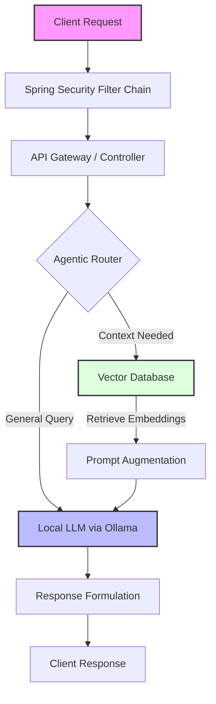
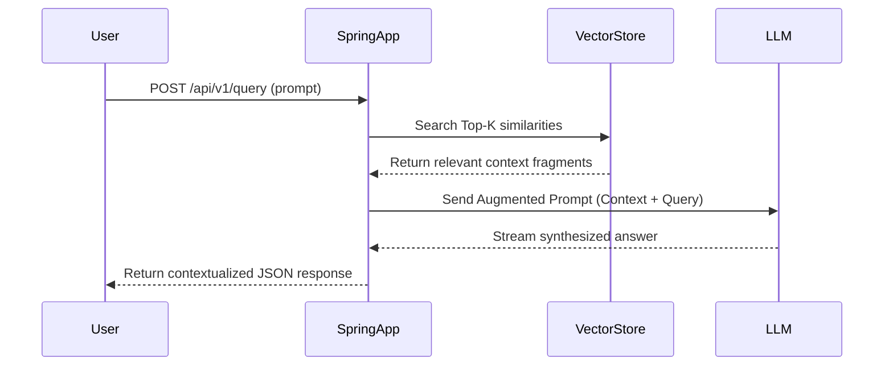

# 🤖 Agentic RAG System


An advanced, autonomous backend system demonstrating state-of-the-art Generative AI integration using **Spring AI**. This project implements an Agentic Retrieval-Augmented Generation (RAG) architecture capable of intelligently routing queries, retrieving dynamic context, and utilizing local Large Language Models for secure, context-aware reasoning.

---

## 🏗️ System Architecture

The core of the system relies on an intelligent routing mechanism that evaluates user prompts and dynamically decides whether to query the vector database, execute a specific tool/function, or synthesize an ensemble response.



---

## ✨ Key Features & Illustrations

### Dynamic Retrieval-Augmented Generation (RAG)

Instead of relying solely on foundational model training data, the system embeds document context in real-time, significantly reducing hallucinations and grounding responses in factual, domain-specific data.



### Autonomous Agentic Routing

The application acts as an orchestrator, deciding how to handle a prompt; with multiple agents sitting at nodes of each step of RAG - Guardrail Agent (Static, Dynamic for pre & post retrieval), Evaluator Agent.

### Localized AI Inferencing

Integrated with Ollama to run models locally, guaranteeing data privacy, eliminating API latency variations, and keeping token costs at zero during development and localized deployment.

---

## 🛠️ Tech Stack

| Category | Technology |
|---|---|
| Core Framework | Java, Spring Boot 3.x |
| AI & Orchestration | Spring AI |
| Security | Spring Security (OAuth2 / JWT) |
| Persistence | Spring Data JPA, PostgreSQL / Vector Database (Qdrant) |
| Containerization | Docker |
| Inference Engine | Ollama |
| API Testing | Postman |

---

## 🚀 Getting Started

### Prerequisites

- Java 17+
- Maven
- [Docker Desktop](https://www.docker.com/products/docker-desktop/)
- [Ollama](https://ollama.ai/) installed and running locally

### Installation

1. **Clone the repository:**
   ```bash
   git clone https://github.com/Ojashwa-droid/Agentic-RAG-System.git
   cd Agentic-RAG-System
   ```

2. **Pull the required LLM via Ollama:**
   ```bash
   ollama run llama3   # Or your specific model of choice
   ```

3. **Start infrastructure via Docker (Database, Vector Store):**
   ```bash
   docker-compose up -d
   ```

4. **Build and run the Spring Boot application:**
   ```bash
   ./mvnw spring-boot:run
   ```

The application should now be running at `http://localhost:8080` (or your configured port).

---

## 📡 Example Usage

```bash
curl -X POST http://localhost:8080/api/v1/query \
  -H "Content-Type: application/json" \
  -d '{"prompt": "Summarize the key points from the uploaded document"}'
```

---

## 🤝 Contributing

Contributions, issues, and feature requests are welcome! Feel free to check the [issues page](https://github.com/Ojashwa-droid/Agentic-RAG-System/issues).

---

## 📄 License

This project is licensed under the MIT License — see the [LICENSE](LICENSE) file for details.

---

## 👤 Author

**Ojashwa**
GitHub: [@Ojashwa-droid](https://github.com/Ojashwa-droid)
